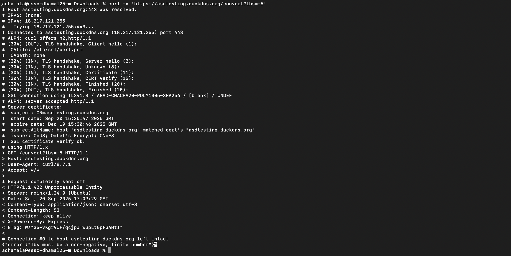
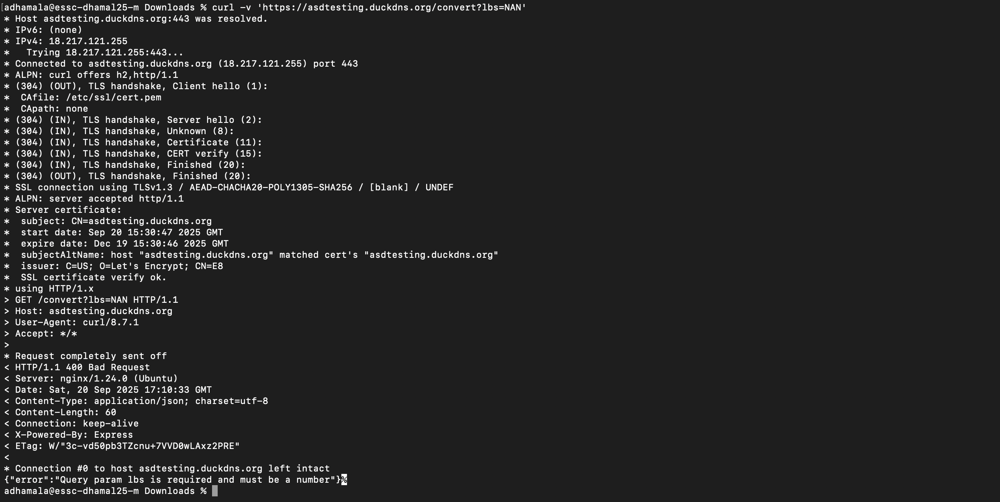

# Project 1 – EC2 REST Service: Pounds → Kilograms

This repository contains the source code for **Project 1** of the **CS 554 Cloud Computing** course at UAH. The project involves provisioning an AWS EC2 instance and deploying a small REST web service that converts **pounds (lbs)** to **kilograms (kg)**.

The architectural design for hosting this service is explained [here](Design.md).

## 1. Prerequisites

* **Ubuntu Linux AMI** on AWS EC2
* **Node.js** and **npm**
* SSH access using a key pair

## 2. Setup and Deployment

### 2.1 EC2 Instance

* An EC2 instance (t2.micro) was provisioned using an Ubuntu AMI.
* A key pair was created for SSH access.
* The Security Group was configured with the following rules:

  * **SSH (TCP 22)**: Allowed only from the owner’s IP address.
  * **HTTP (TCP 80)**: Allowed from anywhere (`0.0.0.0/0`).
  * **HTTPS (TCP 443)**: Allowed from anywhere (`0.0.0.0/0`).

**Public IP:** `https://asdtesting.duckdns.org/convert?lbs=91`

### 2.2 Service Installation

After SSHing into the instance:

```bash
cd ~/p1
npm install express morgan
```

The application source code was placed in the `~/p1` directory.

### 2.3 Running the Service with systemd

A systemd service runs the Node.js application under the non-privileged `ubuntu` user.

**Unit file:** `/etc/systemd/system/p1.service`

```ini
[Unit]
Description=CS554 Project 1 service

[Service]
ExecStart=/usr/bin/node /home/ubuntu/p1/server.js
WorkingDirectory=/home/ubuntu/p1
Restart=on-failure
User=ubuntu
Group=ubuntu

[Install]
WantedBy=multi-user.target
```

Enable and start the service:

```bash
sudo systemctl enable p1
sudo systemctl start p1
sudo systemctl status p1 --no-pager
```

**Service output example:**


### 2.4 Reverse Proxy (NGINX)

NGINX was configured to forward requests from port 80 to the Node.js application running on port 8080:

```nginx
server {
    server_name asdtesting.duckdns.org;

    location / {
        proxy_pass http://127.0.0.1:8080;
        proxy_set_header Host $host;
        proxy_set_header X-Real-IP $remote_addr;
        proxy_set_header X-Forwarded-For $proxy_add_x_forwarded_for;
    }

    listen 443 ssl; # managed by Certbot
    ssl_certificate /etc/letsencrypt/live/asdtesting.duckdns.org/fullchain.pem; # managed by Certbot
    ssl_certificate_key /etc/letsencrypt/live/asdtesting.duckdns.org/privkey.pem; # managed by Certbot
    include /etc/letsencrypt/options-ssl-nginx.conf; # managed by Certbot
    ssl_dhparam /etc/letsencrypt/ssl-dhparams.pem; # managed by Certbot

}
server {
    if ($host = asdtesting.duckdns.org) {
        return 301 https://$host$request_uri;
    } # managed by Certbot


    listen 80;
    server_name asdtesting.duckdns.org;
    return 404; # managed by Certbot
}
```

## 3. API Test Cases

The REST API endpoint is:

```
https://asdtesting.duckdns.org/convert?<value>
```

Responses are in JSON format. Example:

```json
{
    "lbs":91,
    "kg":41.277,
    "formula":"kg = lbs * 0.45359237"
}
```

### 3.1 Happy Path

**Request:**

```bash
curl 'https://asdtesting.duckdns.org/convert?lbs=0'
```

**Response Screenshot:**


### 3.2 Typical Case

**Request:**

```bash
curl 'https://asdtesting.duckdns.org/convert?lbs=150'
```

**Response Screenshot:**


### 3.3 Edge Case

**Request:**

```bash
curl 'https://asdtesting.duckdns.org/convert?lbs=0.1'
```

**Response Screenshot:**


### 3.4 Error Cases

**Missing Parameter**

```bash
curl -v 'https://asdtesting.duckdns.org/convert'
```


**Negative Value**

```bash
curl -v 'https://asdtesting.duckdns.org/convert?lbs=-5'
```



**Non-numeric Value**

```bash
curl -v 'https://asdtesting.duckdns.org/convert?lbs=NAN'
```



## 4. Cleanup

To avoid incurring unnecessary costs, all resources provisioned for this project were terminated. 
The following steps outline the cleanup process:

### 4.1 Teminate EC2 Instance

1.  Navigate to the EC2 Dashboard in the AWS Management Console.
2.  Select the instance from the list.
3.  Choose **Instance state** > **Terminate instance**.
4.  Confirm the termination.

### 4.2 Remove EBS Volumes

In this project, only the root volume was used, so no orphaned volumes were left behind. However, in a multi-volume setup, you'd clean them up like this:

1.  Navigate to the **Volumes** section under **Elastic Block Store** in the EC2 Dashboard.
2.  Filter the volumes by the state **`available`** (unattached).
3.  Select the orphaned volumes and choose **Actions** > **Delete Volume**.

### 4.3 Key Pair
The key pair used for SSH access was also deleted to maintain a clean AWS environment. 

1.  Navigate to the **Key pairs** section under **Network & Security** in the EC2 Dashboard.
2.  Select the key pair used for the project.
3.  Choose **Actions** > **Delete**.

**Screenshot of key pair deletion:**


### 4.4 Security Group
The Security Group that controlled network traffic to the instance was deleted.

1.  Navigate to the **Security Groups** section under **Network & Security** in the EC2 Dashboard.
2.  Select the Security Group created for the project.
3.  Choose **Actions** > **Delete security group**.

**Screenshot of security group deletion:**


By following these steps, all resources associated with Project 1 have been successfully removed, ensuring no further costs are incurred.

